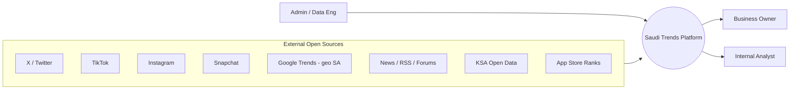
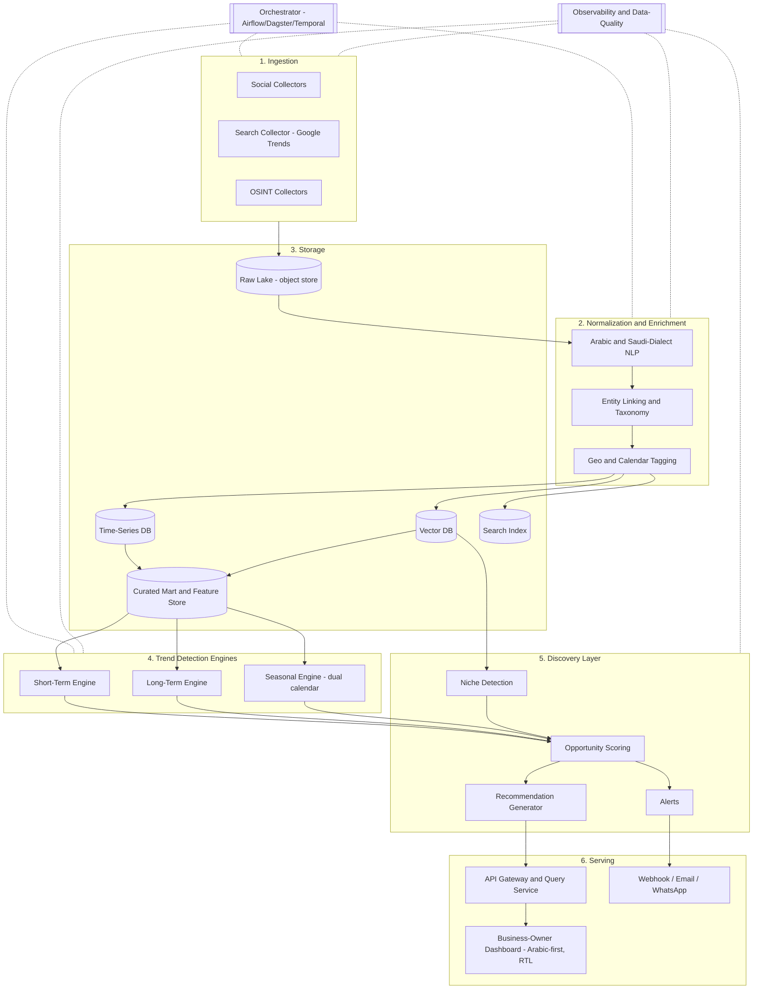
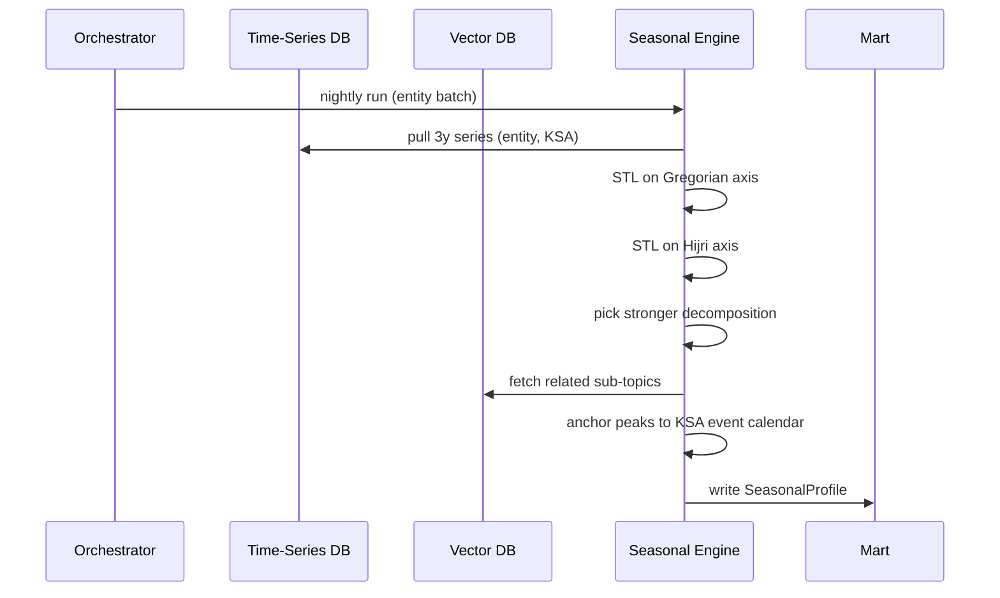
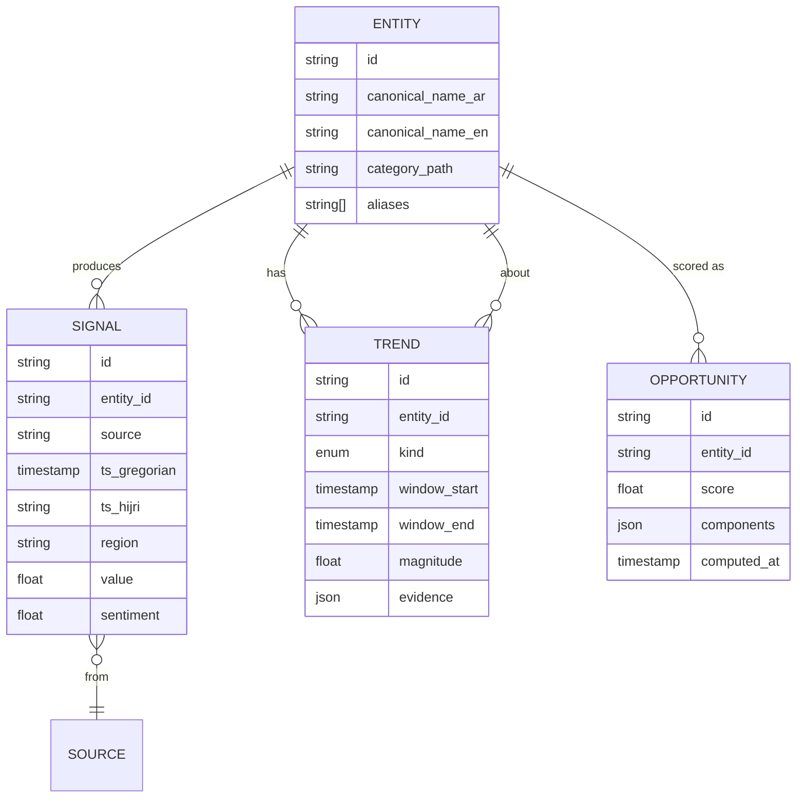

# Saudi Market Trends — Architecture Preview

> **Status:** Phase 0 (architecture only). No code yet.
> **Goal:** Detect Saudi-market trends — **short-term**, **long-term**, and **seasonal** — and turn them into product-discovery recommendations for business owners.
> **Sources:** OSINT / open information, social platforms (X, TikTok, Instagram, Snapchat), search signals (Google Trends, KSA-scoped).
> **Deployment:** Cloud-agnostic (concrete vendor mapping deferred — see appendix).

---

## 1. System context



**Primary user:** the business owner deciding *what* to sell or build in KSA.
**Secondary user:** internal analyst validating signals.
**Admin:** ops/data engineering.

---

## 2. High-level architecture (container view)



---

## 3. Components

### 3.1 Ingestion

Each connector implements one interface:

```
fetch(window: TimeRange, filter: Query) -> RawDocument[]
```

so adding a source is a contract change, not a pipeline change.

| Connector | API | Notes |
|---|---|---|
| X / Twitter | X API v2 | Paid tier; Basic for prototyping, Pro for full-archive |
| TikTok | TikTok Research API | Gated approval; commercial use restricted |
| Instagram | Instagram Graph API (`ig_hashtag_search`) | Needs Meta app review + Business account |
| Snapchat | Public Profiles API / partner program | **Known gap** — no general public trends API; phased in |
| Google Trends | `pytrends` or SerpAPI Google Trends | `geo=SA`; query expansion w/ dialect variants |
| OSINT — News | RSS (Sabq, Argaam, AlEqtisadiah) | Free |
| OSINT — Telegram | MTProto / Bot API on public channels | Free |
| OSINT — Gov | KSA Open Data Portal | Free, mostly slow-changing |
| OSINT — Apps | App-store rank scrapers | Free / cheap |

**Scheduling:** job queue + orchestrator. Per-connector rate-limit + ToS guardrails enforced at the connector, not at the caller.

### 3.2 Normalization & Enrichment

- **Language detection** → MSA Arabic, Saudi dialect, English (code-switching expected).
- **Arabic NLP** — dialect normalization (CAMeL Tools / fine-tuned model), tokenization, NER (products / brands / places), lemmatization, sentiment.
- **Entity linking** to a **canonical taxonomy** (categories → sub-categories → products / brands). This taxonomy is the join key across sources — without it, a TikTok hashtag, an Arabic tweet, and a Google Trends query about the same product can't be aggregated.
- **Geo tagging** to KSA region/city when possible.
- **Calendar tagging** — every record is dual-stamped with Gregorian and Hijri timestamps.
- **Optional translation** for cross-source matching.

### 3.3 Storage

| Store | Role | Retention |
|---|---|---|
| **Raw lake** (object store) | Immutable raw documents, partitioned `source/yyyy/mm/dd/hh` | Long (3y+) |
| **Time-series DB** | Counts, mentions, search-interest per `(entity, region, source)` at 1m / 1h / 1d rollups | Hot 90d, cold archive |
| **Vector DB** | Embeddings of documents and entities (Arabic-aware model). Powers semantic clustering, niche detection, cross-platform dedup | Rolling 12–24m |
| **Search index** | Arabic-aware full-text for analyst exploration | 12m |
| **Curated mart / feature store** | Entity-level features feeding trend engines + discovery | Ongoing |

### 3.4 Trend Detection Engines

All three engines read from the **time-series DB + vector DB**, write trend records to the **mart**.

#### Short-term (hours → ~14 days)

- **Algorithms:** rolling z-score, EWMA, Bayesian online changepoint detection.
- **Signals:** velocity (Δ mentions / Δt), acceleration, novelty (vector distance from existing clusters).
- **Cross-platform corroboration:** signal must appear in ≥ 2 sources to fire — kills single-platform bot noise.
- **Output:** `ShortTermTrend{entity, started_at, magnitude, sources, sample_evidence}`.

#### Long-term (months → years)

- **Algorithms:** STL or Prophet decomposition; Mann-Kendall trend test; 90-day & YoY slopes; cohort drift inside vector clusters (are new sub-topics emerging in a category?).
- **Output:** `LongTermTrend{entity, slope, confidence, supporting_subtopics}`.

#### Seasonal — **dual-calendar** (Saudi-specific design choice)

- **Input axis:** *both* Gregorian and Hijri. The decomposition runs twice — events anchored to Hijri (Ramadan day-of-month, Hajj week, Islamic New Year) decompose cleanly only on the Hijri axis.
- **Plus event-anchored seasonality:** Saudi National Day (Sep 23), Founding Day (Feb 22), Riyadh Season opening, Jeddah Season, school terms.
- **Output:** `SeasonalProfile{entity, calendar, peak_windows[], expected_lift, lead_time}` — i.e. "stock this 6 weeks before Ramadan; expected 3.4× baseline."



### 3.5 Discovery Layer (the product-owner brain)

Turns trend signals into **decisions**.

- **Opportunity scoring** combines:
  `short_term_momentum + long_term_slope + seasonal_lift_now + (1 / competition_density) + market_size_proxy`
  → single 0–100 **opportunity score** per entity.
- **Niche detection** clusters vector embeddings to find rising sub-topics with low existing supply (gap analysis).
- **Recommendation generator** ranks entities and emits each with **evidence**: charts, source quotes, season window, Hijri-calendar peaks.
- **Alerts** fire on threshold breaches per business owner's subscribed categories.

### 3.6 Serving

- **API gateway** → query service (reads mart + TSDB + vector DB).
- **Dashboard** — Arabic-first, RTL: category browser, trend explorer, opportunity feed, season planner.
- **Outbound channels** — webhook, email, WhatsApp Business (high engagement in KSA).

### 3.7 Cross-cutting

- **Orchestration:** Airflow / Dagster / Temporal — chosen at implementation.
- **Observability:** data-quality SLAs (freshness, volume, schema), pipeline metrics, model-drift on the discovery scoring, eval harness for trend precision/recall against a labeled set.
- **Privacy / ToS:** every connector documents legal basis; raw PII is hashed at ingest; per-platform rate-limit and ToS guardrails are mandatory.
- **Cloud-agnostic abstraction:** components named by role (`object_store`, `stream`, `tsdb`, `vectordb`, `search`, `warehouse`, `orchestrator`, `serverless_compute`); vendor mapping in the appendix.

---

## 4. Data model (sketch)



`kind ∈ {short_term, long_term, seasonal}` keeps the three engines schema-compatible.

---

## 5. Saudi-specific design notes

- **Hijri calendar is first-class** — not a post-hoc adjustment. Every timestamp is dual-stamped at ingest; the seasonal engine runs decomposition on both axes.
- **Saudi-dialect NLP** — handle "وش", "كيف", "يبه", and English/Arabic code-switching. NER must learn local brand/product names (e.g., حلا, مفطح, شيلة) that MSA models miss.
- **Right-to-left, Arabic-first UX** — layout, charts, and copy mirror correctly; numerals follow user preference (Arabic-Indic vs. Western).
- **Event calendar** maintained as a first-class data source — Riyadh Season openings, Hajj week, Saudi National Day, school terms — these anchor the seasonal engine.
- **Data residency** — even though deployment is cloud-agnostic, KSA-region options (AWS Bahrain/Riyadh, Google Dammam, stc cloud, Oracle Jeddah) are flagged for when residency becomes a customer/regulatory requirement.

---

## 6. Phased rollout

| Phase | Scope |
|---|---|
| **0** | This architecture document (you are here) |
| **1** | Ingestion (Google Trends + X Basic + RSS) → normalization → TSDB → short-term engine → minimal dashboard |
| **2** | Long-term + seasonal engines, vector DB, niche detection. Add TikTok + IG once approvals land |
| **3** | Discovery scoring, alerts, business-owner self-serve onboarding. Add Snapchat once access is solved |
| **4 (optional pivot)** | Extend to product *delivery*: supplier discovery, logistics signals, fulfillment partner data |

---

## 7. Open questions

- Vendor choices (vector DB, orchestrator, NLP model) — `TBD`, decided when Phase 1 starts.
- Snapchat access path — partner program vs. skip until viable.
- Alerting channels — does v1 include WhatsApp Business API?
- Tenancy model — single-tenant per business vs. multi-tenant SaaS — affects auth and data isolation.

---

## Appendix A — Cloud-agnostic role → vendor mapping

| Role | AWS | GCP | Azure | KSA-resident option |
|---|---|---|---|---|
| object_store | S3 | GCS | Blob | AWS Bahrain/Riyadh, Google Dammam |
| stream | MSK / Kinesis | Pub/Sub | Event Hubs | — |
| tsdb | Timestream | BigQuery / Bigtable | Data Explorer | self-host TimescaleDB |
| vectordb | OpenSearch / pgvector | Vertex Matching Engine | AI Search | self-host Qdrant / Weaviate |
| search | OpenSearch | Elastic on GKE | AI Search | self-host OpenSearch |
| warehouse | Redshift | BigQuery | Synapse | self-host ClickHouse |
| orchestrator | MWAA | Cloud Composer | Data Factory | self-host Dagster / Temporal |
| serverless_compute | Lambda / Fargate | Cloud Run | Functions / Container Apps | self-host on K8s |
